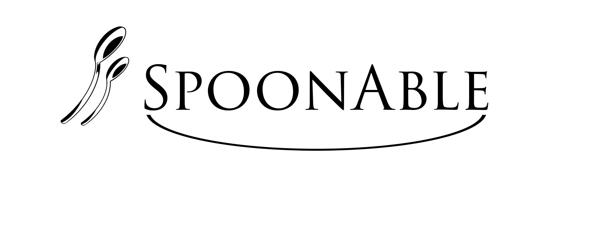

# SpoonAble
## What is SpoonAble?
SpoonAble is a start-up created by two biomedical engineering students, dedicated to providing disability-adaptive, pre-portioned meals to your doorstep. This meal service is targeted towards those with disabilities to help them to effectively and enjoyably navigate the kitchen without the excess strain of shopping or preparation. Simple and healthy recipe kits with pre-prepped ingredients will be designed for easy use by individuals with disabilities. We will include these adapted recipes in a user-friendly app that allows customers to filter results by physical limitations, food allergies, and preference.
## Why is it called "SpoonAble"?
In 2003, Christine Miserandino created a metaphor called "Spoon Theory" that explained the energy expenditure of people with chronic illnesses. Miserandino theorized that people with disabilities have a certain number of "spoons" that they can use to fulfill daily tasks. These tasks can range from attending class or cooking a meal to getting out of bed. Each task subtracts from the amount of energy that person has allotted for the rest of the day. "SpoonAble" is our way of giving both spoons and the ability to complete tasks back to our user-base. We want our customers to be able to prepare a home-cooked meal quickly and easily without having to sacrifice other commitments, relationships, or energy. 

## Get Notified
Express your interest and stay updated as we build SpoonAble.

[👉 Click here to fill out our Interest Form](https://docs.google.com/forms/d/e/1FAIpQLSdlmOwcD8N4Q-6KvnKtQ6YTE_TRn6YeesMQrN-ID1-LAL7B6w/viewform?usp=dialog)

