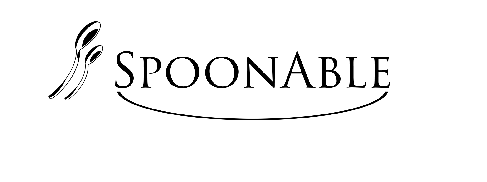

# SpoonAble
## What is SpoonAble?
SpoonAble is a start-up created by two biomedical engineering students, dedicated to developing an assistive device to help people with Parkinson's disease 

## Why is it called "SpoonAble"?
In 2003, Christine Miserandino created a metaphor called "Spoon Theory" that explained the energy expenditure of people with chronic illnesses. Miserandino theorized that people with disabilities have a certain number of "spoons" that they can use to fulfill daily tasks. These tasks can range from attending class or cooking a meal to getting out of bed. Each task subtracts from the amount of energy that person has allotted for the rest of the day. "SpoonAble" is our way of giving both spoons and the ability to complete tasks back to our user-base. We want our customers to be able to prepare a home-cooked meal quickly and easily without having to sacrifice other commitments, relationships, or energy. 

## What are we doing right now?
- We are completing customer discovery to ensure we understand the communities struggles, and develop an evidence-based product
- We have met with 20+ people with disabilities that hinder their ability to cook
- We have narrowed our interview process to people specifically with Parkinson’s and/or tremors
- We will begin ideating potential solutions as we continue to chat with more people, and get their feedback
## Want to Help?
- Express your interest and stay updated as we build SpoonAble.
- Let us know in the form below if you have any questions or inputs :)

[👉 Click here to fill out our Interest Form](https://docs.google.com/forms/d/e/1FAIpQLSdlmOwcD8N4Q-6KvnKtQ6YTE_TRn6YeesMQrN-ID1-LAL7B6w/viewform?usp=dialog)

